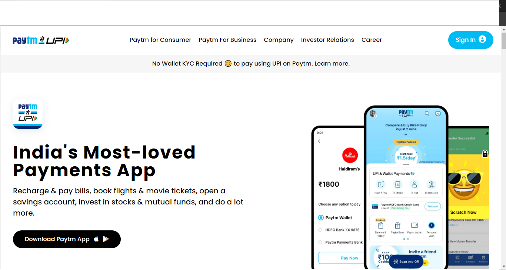

Paytm Clone

Time Required : 9Hrs (Responsive)

Tech Stack : Tailwind Css, Semantic HTML

In Paytm Clone website i learn how to make responsive and smooth design using tailwind css.

[Deployed Link](https://paytm-website-clone.netlify.app/)

